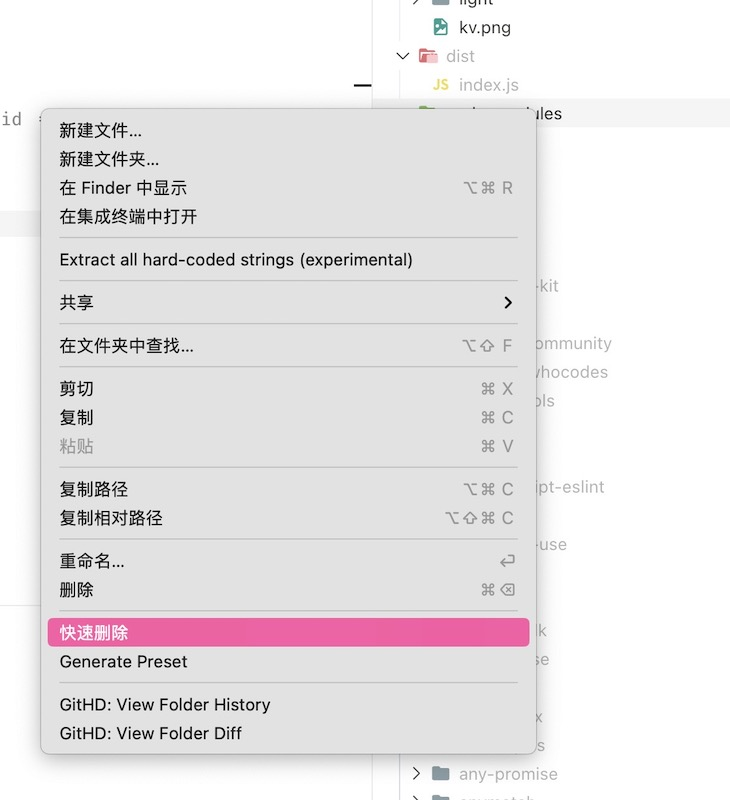

 English | <a href="./README_zh.md">简体中文</a>

Use the rimraf quick delete tool to complete the operation by right-clicking the quick delete, shortcut key deletion is not supported yet.

## Thanks 💕
- [rimraf](https://github.com/isaacs/rimraf)

## :coffee:

[buy me a cup of coffee](https://github.com/Simon-He95/sponsor)

## License

[MIT](./license)
